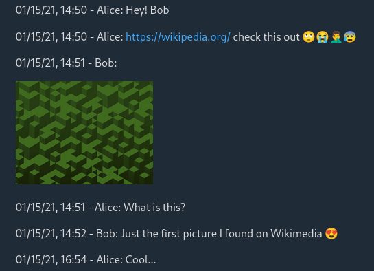

# whappex

A far from perfect tool that allows you to reconstruct your WhatsApp chat exports. It will attempt to re-add your media back in the chat and produce a simple html page stylised with [Water.css](https://github.com/kognise/water.css)

## Legal

The WhatsApp name and logos are trademarks of WhatsApp and may only be used as described in these [Guidelines](https://whatsappbrand.com/).

## Dependencies

- Python 3

## How to use it

You just need to point the script to your exported txt file.

```bash
python3 whappex.py ~/home/user/my-export/a-chat-file.txt
```

You will need to ensure the following:

- When exporting your chats select not to include media
- Ensure that however you extract your media files from your device they maintain their original modification timestamp
- Add the exported txt file and all of your media files in the same directory

For the second point to work the easiest way I have tested so far is to connect my phone to my computer, browse to the apps directory and simply select and drag and paste the media to a local directory. 

This method has been tested on Fedora 33 with the default nautilus file browser. It is interesting that some images appear on the mobile device but not in the file browser of the computer, I have yet to figure out how to copy these.

### About the media files

It is ok for the media files to be nested in other directories but avoid adding any files that are irelevant to this process

#### Why not include media when exporting?

This is because WhatsApp does not export you full chat if you select to do so, with media included your chat export will be only a few months long. In the future whappex will be able to process both exports with or without the media included.

In any case, feel free to export any way you want but curently you will need to exclude the media for whappex to work.

## Output

The script will produce an html file named ```index.html``` in the export directory, **be carefull where you run this script from if you do not want to accidentaly overwite any existing files.**



## Issues

There will probably be many, potentialy even more for windows users but I am not planning to support windows myself. Please feel free to fork and modify accordingly.

## Future plans

### Improve the code overall

This is just a very quick and dirty solution, but I'm releasing it as is in order to help people that want a better export for their chats these days that many are jumping ship (you can check the news if you have missed the whole thing).

### Media matching

The scipt is far from perfect. I've noticed that some media files have a different modification timestamp compared to what appears in the chat or there may exist more than one images with the same timestamp. In general the image matching is fidly for now. So that will be the first to fix.

### Better HTML export

Probably Jinja

### More command line options

I'd like to add arguments for 

- path to txt export
- path to media files
- path for output
- option for enabling/disabling html export
- option for enabling/disabling txt export
- path for exporting to txt (with the media files names added)

## License

MIT License

Copyright 2021 xaderfos (https://github.com/xaderfos)

Permission is hereby granted, free of charge, to any person obtaining a copy of this software and associated documentation files (the "Software"), to deal in the Software without restriction, including without limitation the rights to use, copy, modify, merge, publish, distribute, sublicense, and/or sell copies of the Software, and to permit persons to whom the Software is furnished to do so, subject to the following conditions:

The above copyright notice and this permission notice shall be included in all copies or substantial portions of the Software.

THE SOFTWARE IS PROVIDED "AS IS", WITHOUT WARRANTY OF ANY KIND, EXPRESS OR IMPLIED, INCLUDING BUT NOT LIMITED TO THE WARRANTIES OF MERCHANTABILITY, FITNESS FOR A PARTICULAR PURPOSE AND NONINFRINGEMENT. IN NO EVENT SHALL THE AUTHORS OR COPYRIGHT HOLDERS BE LIABLE FOR ANY CLAIM, DAMAGES OR OTHER LIABILITY, WHETHER IN AN ACTION OF CONTRACT, TORT OR OTHERWISE, ARISING FROM, OUT OF OR IN CONNECTION WITH THE SOFTWARE OR THE USE OR OTHER DEALINGS IN THE SOFTWARE.
